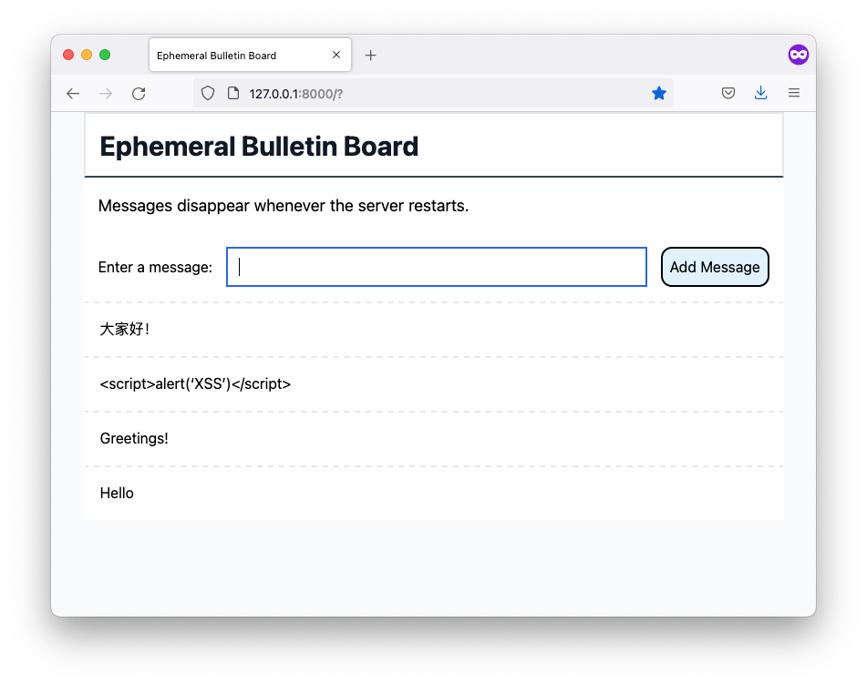
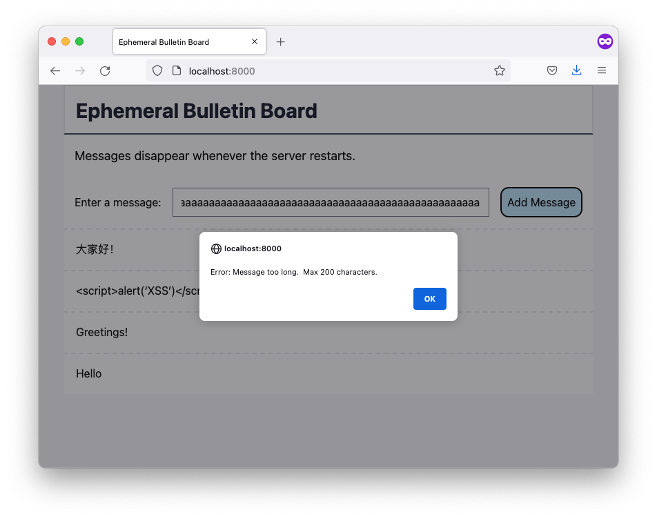

# systeminit-coding-assessment-sde3

An ephemeral bulletin board web app.
This is my implementation of <https://github.com/systeminit/coding-assessment-sde3>.

## How to Use
1. Install Rust, NodeJS, and gulp-cli.
2. Start the server:
   ```
   $ ./build-and-run.sh
   ```
3. Connect to the server with a web browser: <http://localhost:8000/>
4. Enter a message in the box and tap the "Add" button.
5. Refresh the page to see new messages.

## Screenshots


